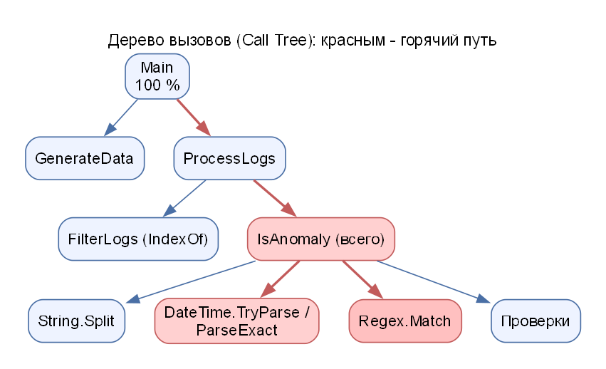

# ССП-4. Теория подробно

Память, стек, кучу, поколения, LOH, утечки и упаковку подробно объясняет **[ПАМЯТЬ.md](ПАМЯТЬ.md)**. Здесь – то, что специфично для четвёртой лабораторной.

## 1. Виды утечек (на защите знать все)

**«Надо знать все виды утечек: событийные, ссылки (статические), горячие пути».**

| Вид | Что это | Признак в лабе |
|---|---|---|
| **Статические ссылки** | объекты лежат в `static`-коллекции и достижимы от корня до конца программы | `MemoryLeakExample`, `StaticLeak`; память не падает после `GC.Collect()` |
| **События (неотписанные подписки)** | источник события хранит ссылки на обработчики и всё, что они захватили | `EventLeakExample`, `EventLeak`; память падает только после отписки |
| **Неосвобождённые `IDisposable`** | ресурсы (потоки) лежат в кэше и не закрываются | `BuggyCode` (`MemoryStream` в статическом списке) |
| **Зацикленные ссылки** | объекты ссылаются друг на друга; GC .NET умеет их собирать, если нет внешней ссылки от корня | |

> **Горячие пути** – не утечка памяти, а участок кода, на который уходит больше всего **времени**. Это тема профилирования; про них спрашивают отдельно: «что такое горячий путь, как его найти».

## 2. Профилирование

**Профилирование** – измерение, на что тратится время (или память) в программе, чтобы оптимизировать **именно узкое место**, а не «всё подряд».

| Понятие | Что значит |
|---|---|
| **Call Tree (дерево вызовов)** | иерархия методов: кто кого вызывает, сколько времени заняло каждое звено |
| **Total time** (полное время) | время метода вместе со всеми вложенными вызовами |
| **Own time / Self time** (собственное время) | время метода **без** вложенных вызовов: сколько он «тратит сам» |
| **Hot path (горячий путь)** | цепочка вызовов от `Main` вниз, где сосредоточена основная доля времени |
| **Снимок памяти (snapshot)** | «фотография» кучи для поиска утечек |

### Как устроен наш профилировщик

В методичке время измеряется вручную: перед шагом запускается `Stopwatch`, после шага результат складывается в словарь «имя → время и число вызовов» (`AddCall`). В конце словарь выводится деревом с долей времени от родителя в процентах и «гистограммой» из символов `#`.

> **Внимание:** в методичке метод `IsAnomaly (own time)` измеряет **весь** `IsAnomaly` целиком (включая вложенные шаги). Поэтому его доля ~94 % – это не «чистое собственное время», а полное время метода.

### Методы с наибольшим собственным временем (результат лабы) и причины

| Метод | Почему медленный |
|---|---|
| `GenerateData` | в цикле на 10 000 записей форматируются даты, склеиваются строки через `StringBuilder`, генерируются случайные числа |
| `Regex.Match` | регулярное выражение разбирается и применяется к каждой строке; сопоставление с шаблоном дороже обычных операций со строкой |
| `DateTime.TryParse` / `ParseExact` | разбор текста с датой с учётом культуры и формата |
| `String.Split` | создаёт новый массив строк для каждой записи (выделение памяти) |
| `Checks` | поиск подстроки и сравнение дат |

### Вопрос про `DateTime.ParseExact` вместо `TryParse`

`ParseExact(текст, "yyyy-MM-dd HH:mm:ss.fff", CultureInfo.InvariantCulture)` разбирает строку **строго по заданному формату**: быстрее и безопаснее, если формат известен. Но в нашем измерении выигрыша **нет**: `ParseExact` 7,1 мс против `TryParse` 2,5 мс (на ~5000 вызовов). Объяснение: для строк в «обычном» ISO-подобном формате `TryParse` уже эффективен; `ParseExact` выбрасывает исключение при ошибке формата (у нас оно перехвачено), а универсальный разбор по заданному шаблону не всегда быстрее. Практический вывод: **не оптимизируйте вслепую, а измеряйте**. `ParseExact` оправдан, когда формат строго задан и строки другого формата нужно отвергать.

### Собственный код: строка в цикле

`result += "слово ";` в цикле создаёт **новую строку** на каждом шаге (строки неизменяемы) и копирует весь накопленный текст: затраты растут **квадратично** (при 20 000 повторов ≈ 575 мс). `StringBuilder` – буфер символов, дописывает в конец: ≈ 0,8 мс. Это типичный горячий путь: простой участок, на который приходится ~97 % времени.

## 3. Вопросы по заданиям

Ответы – в [05-ЗАЩИТА.md](05-ЗАЩИТА.md).
