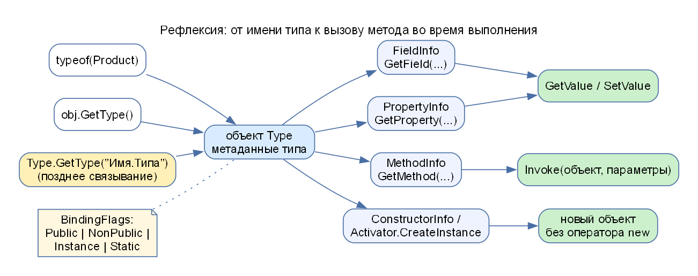
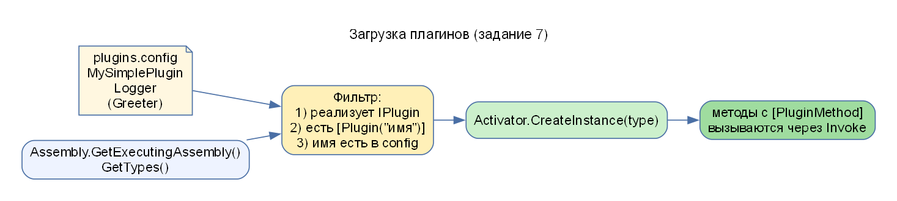

# ССП-3. Теория подробно

## 1. Что такое рефлексия

Обычно программист пишет код, зная классы, их методы и поля заранее: `product.Price = 10;`. Компилятор проверяет, что поле `Price` существует.

**Рефлексия (Reflection)** – это возможность программы **во время работы** узнать, из чего состоит тип (его поля, свойства, методы, конструкторы, атрибуты) и **работать с ними по именам**, как если бы вы читали «чертёж» класса. Представьте, что вы получили закрытую коробку (класс), про которую ничего не знаете. С помощью рефлексии вы можете заглянуть внутрь: узнать, что там лежит, достать вещи и даже нажать скрытую кнопку.



### Зачем это нужно

- сериализаторы (превращают объект в JSON, перебирая его свойства);
- ORM (сопоставляют поля класса и столбцы таблицы);
- DI-контейнеры (создают объекты по описанию);
- системы плагинов (загружают классы по имени из файла);
- тестовые библиотеки.

## 2. Основные классы (`using System.Reflection;`)

| Класс | Назначение |
|---|---|
| `Type` | описание типа: имя, базовый тип, члены |
| `FieldInfo` | описание поля (`GetValue`, `SetValue`) |
| `PropertyInfo` | описание свойства (`GetValue`, `SetValue`) |
| `MethodInfo` | описание метода (`Invoke`, `CreateDelegate`) |
| `ConstructorInfo` | описание конструктора (`Invoke`) |
| `Assembly` | сборка (скомпилированный `.dll`/`.exe`): `GetTypes()` – все типы |
| `Activator` | динамическое создание объектов: `Activator.CreateInstance(type)` |

## 3. Три способа получить `Type`

| Способ | Пример | Когда |
|---|---|---|
| `typeof(T)` | `typeof(Product)` | тип известен **при компиляции** |
| `obj.GetType()` | `product.GetType()` | есть объект, нужен его **фактический** тип во время выполнения |
| `Type.GetType("имя")` | `Type.GetType("LabReflection.DynamicCalculator")` | тип известен только **по строке** (позднее связывание) |

**Разница `typeof` и `GetType()`:** `typeof` работает с типом, известным при компиляции; `GetType()` вызывается у объекта и возвращает его фактический тип в момент выполнения (например, у переменной типа `object` объект может оказаться `string`).

## 4. BindingFlags

Метод `GetMethods()` без аргументов возвращает только **публичные** методы. Чтобы искать иначе, указывают флаги `BindingFlags` (комбинируются знаком `|`):

| Флаг | Что искать |
|---|---|
| `Public` | публичные члены |
| `NonPublic` | приватные и защищённые (`private`, `protected`, `internal`) |
| `Instance` | члены объекта (нестатические) |
| `Static` | статические члены |

Пример: приватное поле экземпляра ищется так: `GetField("_x", BindingFlags.NonPublic | BindingFlags.Instance)`. Без флагов приватное поле **не будет найдено** (результат `null`).

Методы `get_` и `set_` в списке методов – это **автоматически созданные** компилятором методы доступа свойств; в задании 2 их фильтруют.

## 5. Работа с членами

```csharp
FieldInfo f = type.GetField("_price", BindingFlags.NonPublic | BindingFlags.Instance);
double v = (double)f.GetValue(obj);   // прочитать приватное поле
f.SetValue(obj, 1500.0);              // записать

MethodInfo m = type.GetMethod("ValidatePrice", BindingFlags.NonPublic | BindingFlags.Instance);
m.Invoke(obj, null);                  // вызвать приватный метод без параметров
```

`Invoke(объект, object[] параметры)` – вызов метода по его описанию; `null` вместо параметров – если их нет; для статического метода вместо объекта передают `null`.

**Делегат вместо `Invoke`:** `method.CreateDelegate(typeof(Func<int,int,int>), obj)` создаёт обычный делегат, который затем вызывается как функция: быстрее повторных `Invoke`.

## 6. Динамическое создание объектов

`Activator.CreateInstance(type)` – конструктор без параметров; `Activator.CreateInstance(type, new object[] { 25, "Name", 3.5 })` – конструктор с параметрами; либо `ConstructorInfo.Invoke(...)`. Оператор `new` не используется.

## 7. Позднее связывание (Late Binding)

- **Раннее связывание:** тип, метод, параметры известны при компиляции, компилятор проверяет вызов (`calculator.Add(1, 2)`).
- **Позднее связывание:** тип/метод выбираются **во время выполнения** по имени (`Type.GetType("...")`, `GetMethod("Add")`, `Invoke`). Ошибки обнаруживаются только при запуске.

## 8. Атрибуты и плагины

**Атрибут** – метка-метаданные над классом или методом: `[Plugin("Calculator")]`. Сам по себе он ничего не делает, но его можно прочитать рефлексией: `type.GetCustomAttribute<PluginAttribute>()`.

Схема системы плагинов (задание 7):



1. Интерфейс `IPlugin` – общий контракт для всех плагинов (метод `Execute()`).
2. Классы-плагины реализуют `IPlugin` и помечены `[Plugin("имя")]`.
3. Загрузчик читает имена из `plugins.config`, получает все типы сборки (`GetTypes()`), отбирает классы, реализующие `IPlugin` (`typeof(IPlugin).IsAssignableFrom(type)`), проверяет атрибут, создаёт объект (`Activator.CreateInstance`) и вызывает методы через рефлексию.
4. Чтобы подключить новый плагин, **код загрузчика менять не нужно**: достаточно нового класса и строки в конфигурации.

## 9. «Чёрный ящик»

**Чёрный ящик** – класс, внутреннее устройство которого мы **заранее не знаем** (или оно скрыто модификаторами `private`). Снаружи видны только публичные методы. Рефлексия позволяет заглянуть внутрь: узнать список приватных членов, прочитать их и вызвать. В лабораторной это класс `SecretCalculator`.

## 10. Риски и недостатки рефлексии (на защите назвать все)

1. **Нарушение инкапсуляции** (безопасности): обход ограничений `private` – можно прочитать и изменить то, что автор класса скрыл.
2. **Медленная операция:** поиск члена по имени и вызов через `Invoke` значительно медленнее прямого вызова.
3. **Ошибки времени выполнения:** если реальная структура типа не совпадает с ожидаемой (имя поля изменилось), компилятор этого не заметит; программа упадёт во время работы.
4. Сложнее рефакторинг и отладка (имена в строках не переименовываются автоматически).
5. Нужно проверять результаты поиска на `null` и обрабатывать исключения.
