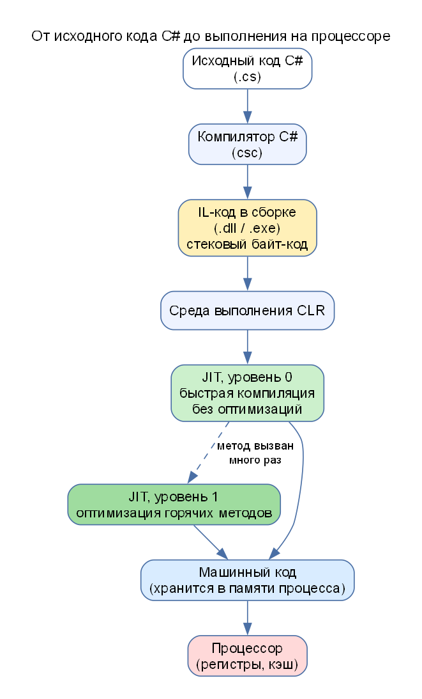

# ССП-1. Теория подробно (для тех, кто видит это впервые)

## 1. Как программа на C# превращается в работающую



1. Вы пишете текст на C# (`.cs`).
2. **Компилятор C#** превращает его **не в машинный код**, а в **IL** (Intermediate Language, «промежуточный язык»), который кладёт в файл `.dll` или `.exe`.
3. При запуске программы среда выполнения **CLR** (Common Language Runtime) берёт IL и с помощью **JIT-компилятора** (Just-In-Time, «точно в срок») превращает его в **машинный код** вашего процессора. Это происходит **прямо во время работы программы**, метод за методом.
4. Процессор выполняет машинный код. Скомпилированный код лежит в памяти процесса.

**Зачем два шага?** IL не зависит от процессора и операционной системы: одну и ту же сборку можно запустить на Windows, Linux, Mac, x64 или ARM: каждый раз JIT получит код для своего процессора. Все языки .NET (C#, F#, VB) компилируются в один и тот же IL.

## 2. Что такое IL

IL – это язык **стековой машины**. Идея: у метода есть **стек вычислений** (стопка значений). Команды берут операнды с вершины стека и кладут результат обратно.

Пример `a + b` (метод `Add(int a, int b)`):

| Команда IL | Hex | Что делает | Стек после команды |
|---|---|---|---|
| `ldarg.0` | `02` | загрузить в стек аргумент 0 (`a`) | `[a]` |
| `ldarg.1` | `03` | загрузить аргумент 1 (`b`) | `[a, b]` |
| `add` | `58` | взять два верхних, сложить, положить сумму | `[a+b]` |
| `ret` | `2A` | вернуть значение с вершины стека | `[]` |

Поэтому метод сложения занимает **4 байта**: `02 03 58 2A`. Метод умножения (задание 1) отличается одним байтом: `mul` – это `5A`, получается `02 03 5A 2A`.

### Группы команд IL

| Группа | Команды | Назначение |
|---|---|---|
| Загрузка / сохранение | `ldarg`, `ldloc`, `stloc`, `starg`, `ldc.i4`, `ldstr` | положить в стек аргумент / локальную переменную / число / строку; сохранить из стека |
| Арифметика | `add`, `sub`, `mul`, `div` | вычисления над верхушкой стека |
| Сравнение | `ceq`, `cgt`, `clt` | сравнить и положить 0 или 1 |
| Переходы | `br`, `brtrue`, `brfalse`, `bgt`, `blt`, `ble` | условные и безусловные переходы (циклы, `if`) |
| Вызовы | `call`, `callvirt`, `ret` | вызвать метод, вернуться |
| Объекты | `newobj`, `ldfld`, `stfld` | создать объект, прочитать / записать поле |

### Чем отличаются `stloc` и `starg`

- `stloc` (store local) – **сохранить значение с вершины стека в локальную переменную**.
- `starg` (store argument) – **сохранить значение с вершины стека в аргумент метода**.

### Разбор IL метода с циклом (из вывода программы)

Метод:

```csharp
static int MethodWithLoop(int n)
{
    int sum = 0;
    for (int i = 1; i <= n; i++) sum += i;
    return sum;
}
```

Байты (Debug): `00 16 0A 17 0B 2B 08 06 07 58 0A 07 17 58 0B 07 02 FE 02 16 FE 01 0C 08 2D ED 06 0D 2B 00 09 2A`

| Байты | Команда | Смысл |
|---|---|---|
| `00` | `nop` | пустая команда (в Debug добавляется для отладчика) |
| `16` `0A` | `ldc.i4.0`, `stloc.0` | `sum = 0` |
| `17` `0B` | `ldc.i4.1`, `stloc.1` | `i = 1` |
| `2B 08` | `br.s +8` | перейти к проверке условия цикла |
| `06 07 58 0A` | `ldloc.0`, `ldloc.1`, `add`, `stloc.0` | `sum = sum + i` |
| `07 17 58 0B` | `ldloc.1`, `ldc.i4.1`, `add`, `stloc.1` | `i = i + 1` |
| `07 02 FE 02` | `ldloc.1`, `ldarg.0`, `cgt` | положить `i > n` |
| `16 FE 01 0C` | `ldc.i4.0`, `ceq`, `stloc.2` | инвертировать: `i <= n` во временную переменную 2 |
| `08 2D ED` | `ldloc.2`, `brtrue.s -19` | если `i <= n`, вернуться в тело цикла |
| `06 0D` | `ldloc.0`, `stloc.3` | временная переменная 3 = `sum` |
| `2B 00` | `br.s +0` | переход на следующую команду (след Debug-сборки) |
| `09 2A` | `ldloc.3`, `ret` | вернуть `sum` |

Локальных переменных четыре: `sum`, `i`, временная для сравнения, временная для результата. В Release-сборке эти временные переменные и `nop` исчезают.

### Почему «максимальный размер стека» равен 8

Для очень коротких методов компилятор использует компактный («tiny») заголовок тела метода, в котором `MaxStack` не хранится, и среда сообщает значение по умолчанию 8. Для методов с обычным заголовком (цикл, условие) значение 2 настоящее.

## 3. JIT-компиляция

**JIT** – это компилятор, работающий во время выполнения. При **первом вызове** метода CLR:

1. находит IL метода;
2. вызывает JIT, который строит машинный код (распределяет значения по **регистрам** процессора, выбирает инструкции);
3. сохраняет машинный код **в памяти процесса** и дальше вызывает его напрямую.

При следующем запуске программы всё повторяется заново (машинный код не сохраняется на диск, если не используется предкомпиляция).

### Режимы

| Режим | Как работает | Плюсы и минусы |
|---|---|---|
| **Normal JIT** | метод компилируется при первом вызове сразу с оптимизацией | код быстрый, но запуск медленнее |
| **Tiered Compilation** (по умолчанию) | **уровень 0**: быстрая компиляция без глубоких оптимизаций; когда метод вызван много раз («горячий»), он перекомпилируется на **уровень 1** с оптимизациями | запуск быстрее, горячие участки быстрые |

### Холодный старт

**Холодный старт** – медленное выполнение первых вызовов: затрачивается время на JIT-компиляцию и загрузку сборок. В лабораторной видно по заданию 4.1: первый вызов метода `SumArray` занимает в разы дольше последующих.

Как уменьшить:

- **ReadyToRun** (R2R) – предкомпиляция в машинный код при сборке;
- **Native AOT** – полная компиляция в машинный код без JIT;
- **Прогрев (warm-up)** – вызвать метод заранее, до ответственного участка;
- включить Tiered Compilation (по умолчанию включена).

### Как JIT оптимизирует часто вызываемые методы

Среда ведёт счётчик вызовов. Когда метод становится «горячим», он перекомпилируется на уровень 1: **встраивание** (inlining) коротких методов, оптимизация циклов, использование данных профиля (PGO), удаление ненужных проверок.

### Вопрос «кэш и регистры?» (из чата)

- **Регистры:** JIT решает, какие локальные переменные и промежуточные значения держать в регистрах процессора (самая быстрая память). В IL нет регистров, там стек вычислений, поэтому именно JIT при трансляции «размещает» значения по регистрам.
- **Кэш:** машинный код метода после компиляции хранится в памяти процесса (в области кода); повторные вызовы идут по готовому адресу, без повторной компиляции. Отдельно существует **кэш процессора** (L1/L2/L3), в котором при выполнении оказываются часто используемые инструкции и данные. Кэшем «JIT результата на диск» в обычном запуске .NET нет.

### Что такое AOT

**AOT (Ahead-Of-Time)** – компиляция в машинный код **заранее**, до запуска. Плюсы: быстрый старт, нет JIT во время работы. Минусы: нет оптимизаций по профилю выполнения, размер файла больше, ограничения для динамических возможностей (рефлексия, динамическая генерация кода). В .NET: ReadyToRun и Native AOT.

## 4. Динамические методы: `DynamicMethod` и `ILGenerator`

`DynamicMethod` – класс, позволяющий **создать метод во время выполнения**, без исходного кода на C#. `ILGenerator` – «ручка», которой вы по одной записываете команды IL (`il.Emit(OpCodes.Add)`). В конце вы превращаете динамический метод в **делегат** (`CreateDelegate`) и вызываете его как обычную функцию.

Практика применения: ORM, сериализаторы, DI-контейнеры, прокси и мок-библиотеки, вычислители выражений, скриптовые движки: везде, где код нужно «собрать» под данные, известные только при запуске.

### Метки и переходы

Для циклов и условий используются **метки** (`Label`): `il.DefineLabel()` – создать метку, `il.MarkLabel(label)` – «поставить» её на текущую позицию, `il.Emit(OpCodes.Br, label)` – безусловный переход, `Bgt`/`Ble` – переход по условию (branch if greater than / less or equal).

### Рекурсия в IL

Метод вызывает сам себя командой `call` с самим `DynamicMethod` в качестве цели: `il.Emit(OpCodes.Call, dynamicMethod)`. Условие остановки (`n <= 1`) возвращает 1, иначе возвращается `n * Factorial(n - 1)`.

## 5. BenchmarkDotNet: как измерять скорость кода

Простые замеры `Stopwatch` ненадёжны: на результат влияют JIT, прогрев, другие процессы. **BenchmarkDotNet** запускает измерение многократно в отдельном процессе, учитывает прогрев и считает статистику.

| Столбец | Что значит |
|---|---|
| `Method` | имя тестируемого метода |
| `Mean` | среднее время одного вызова (нс = наносекунды, 1 нс = 10⁻⁹ с) |
| `Error` | половина 99,9 % доверительного интервала |
| `StdDev` | стандартное отклонение |
| `Ratio` | во сколько раз дольше/быстрее, чем метод, помеченный `Baseline = true` |
| `Allocated` | сколько памяти выделено на вызов (`-` = не выделяется) |

Атрибуты: `[Benchmark]` – метод измерять; `[GlobalSetup]` – выполнить один раз перед измерением; `[MemoryDiagnoser]` – считать память; `[ShortRunJob]` – короткий режим (меньше повторов, быстрее, но больше погрешность).

**Почему C#-метод может быть «быстрее воздуха» (0,09 нс):** JIT встраивает короткий метод и убирает лишнее, а BenchmarkDotNet делит время на число повторов. Такие значения меньше времени одного такта процессора, они показывают, что код почти полностью оптимизирован.

## 6. Вызов через делегат и виртуальный метод

- **Прямой вызов** – самый быстрый, JIT может встроить метод.
- **Через делегат** – вызов по ссылке на метод, добавляет косвенность.
- **Виртуальный метод** (`virtual`) – адрес метода выбирается по типу объекта во время выполнения.

В выводе лабораторной видно: прямой цикл быстрее делегата и виртуального вызова.
