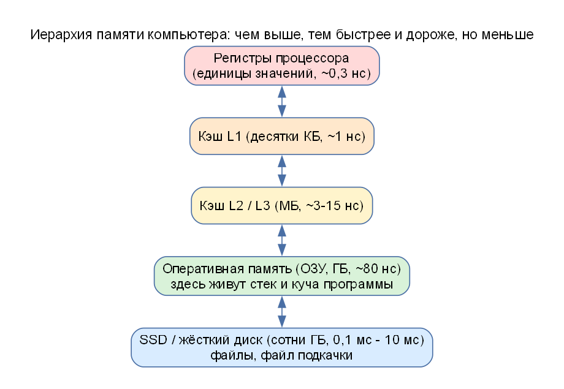
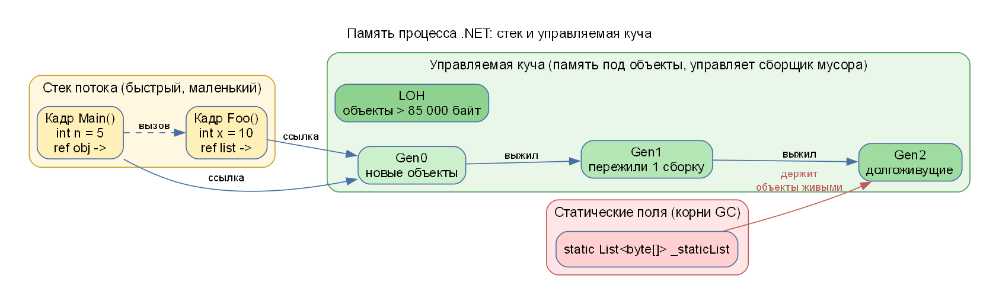
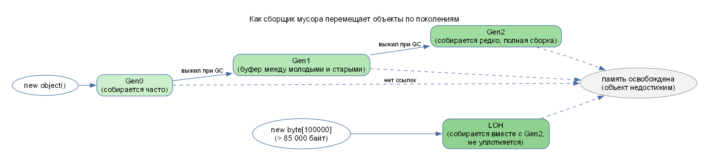
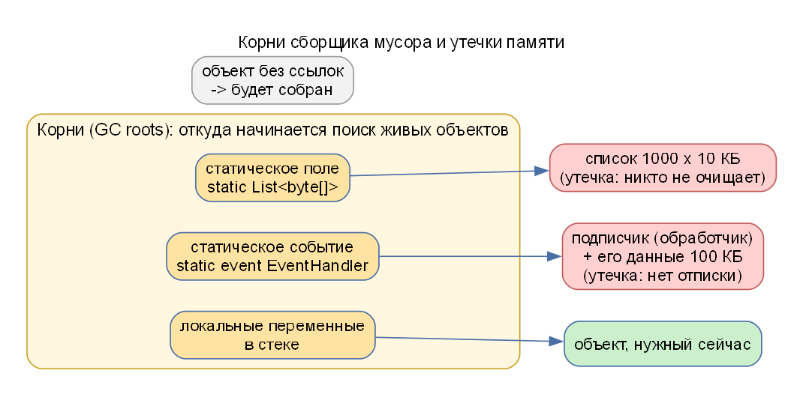
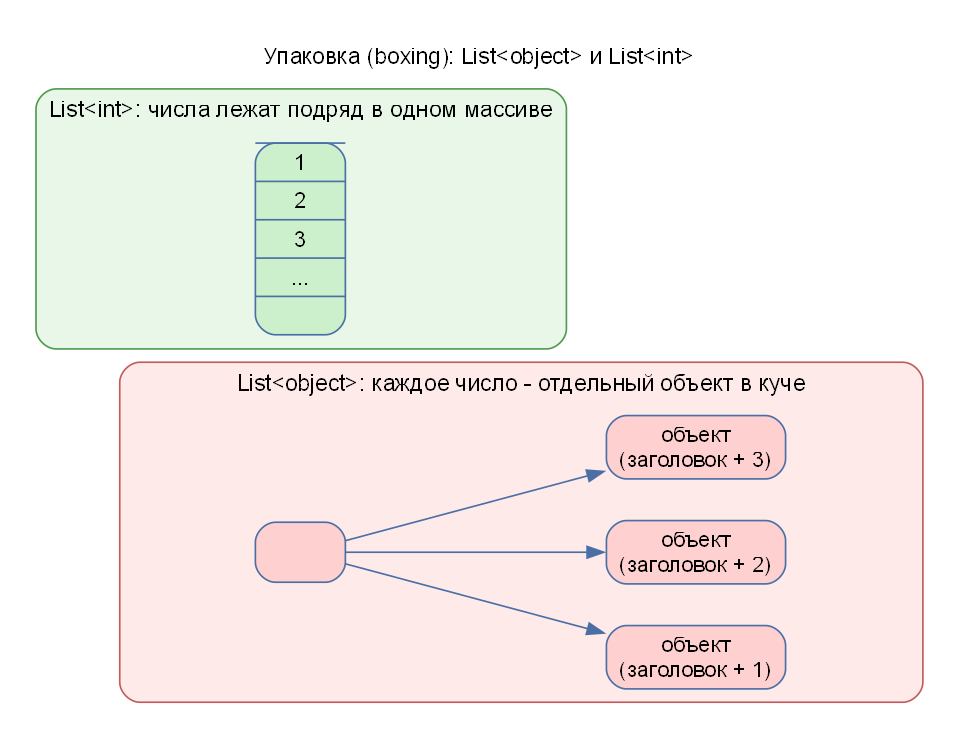
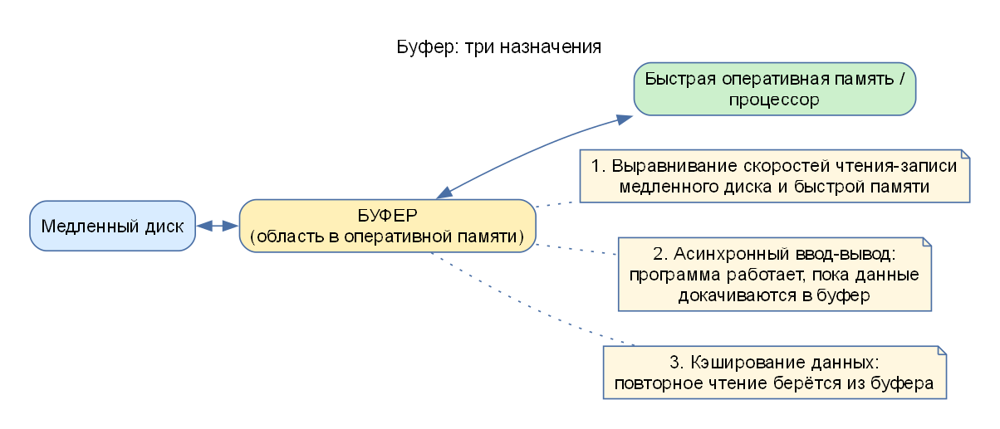
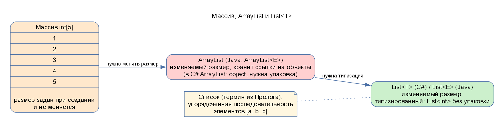

# Память: подробный и понятный разбор

Этот документ объясняет, что такое память компьютера и памяти программы, с нуля. Он нужен для лабораторных работ ССП 1, 2 и 4 (JIT, стек, куча, сборщик мусора, утечки) и для вопросов на защите («куча, стек, кэш, буфер»). Сначала идёт простой рассказ с аналогиями, потом точные термины.

> Если времени мало: прочитайте разделы 1, 3, 4, 5, 6 и «Шпаргалка» в конце.

---

## 1. Простая аналогия: рабочий стол, шкаф, склад

Представьте, что вы делаете курсовую.

| Что в жизни | Что в компьютере | Скорость | Объём |
|---|---|---|---|
| Мысль в голове, которую вы держите «прямо сейчас» | **Регистр** процессора | мгновенно | несколько чисел |
| Листок, лежащий перед глазами | **Кэш** процессора (L1, L2, L3) | очень быстро | килобайты – мегабайты |
| Рабочий стол | **Оперативная память (ОЗУ, RAM)** | быстро | гигабайты |
| Шкаф в комнате | **SSD / жёсткий диск** | медленно | сотни гигабайт |
| Склад в другом городе | **Сеть, интернет** | очень медленно | почти без ограничений |

Процессор может работать только с тем, что лежит в регистрах. Всё остальное он «подтягивает» вверх по лестнице: диск → ОЗУ → кэш → регистр. Поэтому программа, которая обращается к данным аккуратно (рядом лежащие данные подряд), работает намного быстрее.



### Что запомнить

- **Чем быстрее память, тем она меньше и дороже.**
- Программы и их данные живут в **оперативной памяти**. Когда компьютер выключают, ОЗУ очищается, поэтому всё важное сохраняют на диск.
- Слова «**стек**» и «**куча**» – это не два разных устройства, а **две области внутри оперативной памяти**, которые программа использует по-разному.

---

## 2. Процесс, поток, виртуальная память

- **Программа** – файл на диске (например, `Lab2.dll`).
- **Процесс** – запущенная программа. Операционная система выделяет ему **своё адресное пространство**: процесс видит «свою» память и не видит память чужих процессов. Это защита: «глючная» программа не ломает другие.
- **Поток (thread)** – «исполнитель» внутри процесса. В одном процессе может быть много потоков (например, поток сервера и потоки клиентов в АИРП 2). **У каждого потока свой стек, а куча общая для всего процесса.**
- **Виртуальная память.** Программа получает «виртуальные» адреса, а операционная система сама решает, где это лежит физически: в ОЗУ или временно сброшено на диск (**файл подкачки**). Если ОЗУ не хватает и система часто «гоняет» данные на диск, всё сильно тормозит.


В лабораторной ССП/АИРП это важно для вопроса из чата «**сокеты через потоки или через процесс**». Потоки одного процесса видят общую память (поэтому счёт `static int amount` общий, достаточно «глобальной переменной»), а отдельные процессы обмениваются данными только через каналы связи: сокет, файл и т. п.

---

## 3. Стек (stack)

**Стек** – область памяти, где хранится «рабочее состояние вызовов функций». Название от англ. *stack* – стопка тарелок: положили сверху – взяли сверху (**LIFO**: последним пришёл – первым ушёл).

Что лежит в стеке:

1. **Локальные переменные** методов (`int n = 5;`).
2. **Параметры** вызываемых методов.
3. **Адрес возврата** – куда вернуться после окончания метода.
4. **Ссылки** на объекты (сами объекты лежат в куче, в стеке только «стрелка» на них).

Как это работает: при вызове метода на вершину стека кладётся блок – **кадр (frame)**. Когда метод закончился, кадр снимается, и все его локальные переменные «исчезают» (память освобождается мгновенно, без сборщика мусора).

```csharp
void Main()
{
    int n = 5;        // n лежит в кадре Main
    Foo(n);           // создаётся кадр Foo с копией n
}                     // кадр Main снят
void Foo(int x) { int y = x * 2; }   // x и y живут только пока работает Foo
```

Свойства стека:

- очень быстрый (достаточно сдвинуть «указатель вершины»);
- маленький (порядка мегабайта на поток);
- если вложенных вызовов слишком много (бесконечная рекурсия), стек переполняется – ошибка **StackOverflow**;
- у **каждого потока свой стек**.

> Определение из чата (для устного ответа): *стек – область оперативной памяти, выделяемая процессу; в стеке хранятся локальные переменные и вызовы подпрограмм (процедур и функций); стек используется и при обработке прерываний.* Уточнение: в современных ОС и в .NET стек выделяется каждому потоку процесса.

---

## 4. Куча (heap)

**Куча** – область памяти для **объектов**, которые создаются оператором `new`. В отличие от стека:

- память выделяется «по требованию» и на любое время;
- освобождается не сама, а **сборщиком мусора** (в .NET и Java) или вручную (в C/C++);
- работает медленнее стека, зато объём ограничен только ОЗУ.

```csharp
var list = new List<int>();   // list (ссылка) лежит в стеке, сам объект List - в куче
```

### Значимые и ссылочные типы (C#)

| Тип | Примеры | Где хранится значение |
|---|---|---|
| **Значимый** (value type) | `int`, `double`, `bool`, `struct` | прямо в переменной: в стеке (локальная) или внутри объекта (поле) |
| **Ссылочный** (reference type) | `class`, `string`, массивы, `List<T>` | в куче; в переменной только **ссылка** |



---

## 5. Сборщик мусора (GC, Garbage Collector)

В C# и Java программист не освобождает память вручную: это делает **сборщик мусора**.

### Как он решает, что объект «мусор»

1. Есть **корни (roots)** – «отправные точки»: локальные переменные в стеке, **статические поля**, регистры.
2. GC идёт по ссылкам от корней и помечает все **достижимые** объекты как живые.
3. Всё, до чего дойти нельзя, – мусор: память можно переиспользовать.
4. Живые объекты «сдвигаются» (**уплотнение, compaction**), чтобы не оставалось дыр.

> Главное правило: **объект живёт, пока до него можно дойти от корня.** Утечки памяти в C# – это когда мы *случайно оставляем* ссылку на ненужный объект (чаще всего в статическом поле или в событии).

### Поколения (generations)

Наблюдение: **большинство объектов живёт недолго** (временные строки, промежуточные результаты). Поэтому кучу делят на поколения:

| Поколение | Что там | Как часто собирается |
|---|---|---|
| **Gen0** | новые объекты | очень часто, это быстро |
| **Gen1** | пережили одну сборку | реже |
| **Gen2** | долгоживущие | редко (полная сборка, дорого) |
| **LOH** (Large Object Heap) | объекты **> 85 000 байт** | вместе с Gen2, **обычно не уплотняется** |

Объект, переживший сборку, «повышается»: Gen0 → Gen1 → Gen2. В лабораторных это видно через `GC.GetGeneration(obj)`.



### Почему LOH отдельно

Большие массивы (больше 85 000 байт ≈ 83 КБ) дорого копировать при уплотнении. Поэтому их кладут в отдельную область и обычно не сдвигают. Побочный эффект – **фрагментация**: между живыми большими объектами остаются «дыры», в них может не поместиться новый большой массив, хотя суммарно свободной памяти хватает.

### Принудительная сборка

`GC.Collect()` запускает сборку немедленно, `GC.WaitForPendingFinalizers()` ждёт завершения финализаторов. В лабораторных это нужно, чтобы **показать**, что память освободилась (или не освободилась). В настоящих программах так делать не рекомендуется.

### Освобождение ресурсов: `IDisposable`

Память под объекты освобождает GC, но **файлы, сокеты, соединения с БД** – внешние ресурсы. Их освобождают явно: `using (var x = new ...) { ... }` или `x.Dispose()`. Финализаторы не гарантируют своевременность и могут не выполниться при завершении программы.

---

## 6. Утечки памяти в .NET

Утечка – рост занятой памяти, потому что **на ненужные объекты остались ссылки**.



| Вид утечки | Почему происходит | Как исправить |
|---|---|---|
| **Статическая ссылка** | статическое поле – корень, объекты в статическом списке живут до конца программы | очищать список, не хранить лишнее в `static` |
| **Событие без отписки** | источник события хранит ссылки на всех подписчиков | отписываться `-=` (например, в `Dispose`) |
| **Неосвобождённый `IDisposable`** | поток/ресурс остаётся в кэше | `Dispose()`, `using` |
| **Зацикленные ссылки** | A ссылается на B, B на A; в .NET сами по себе проблемой не являются (GC находит цикл), но если на них держит корень – утечка | разорвать связь, слабые ссылки |
| **Горячие пути** (не утечка, а узкое место) | участок кода, на который уходит больше всего времени | профилирование (Call Tree), оптимизация |

### Как это видно в лабораторной

- `GC.GetTotalMemory(false)` – сколько занято сейчас.
- `GC.Collect()` и повторное измерение: если память **не упала** – объекты кем-то удерживаются.
- Снимки (snapshots) кучи утилитой `dotnet-gcdump`: сравнивают количество и размер объектов по типам до и после.

---

## 7. Упаковка (boxing)

`int` – значимый тип, обычно лежит прямо в стеке (или в массиве `List<int>` подряд). Если положить `int` в `object` (или в `ArrayList`, `List<object>`), среда создаёт **объект в куче** и копирует туда число: это **упаковка**. Обратное преобразование – **распаковка**.



Последствия: на каждое число отдельный объект (память + нагрузка на GC), хуже работает кэш процессора, потому что объекты разбросаны по куче. Поэтому `List<int>` в лабораторной быстрее `List<object>` в десятки раз.

---

## 8. Кэш процессора и «локальность данных»

Процессор читает память **порциями** (строка кэша обычно 64 байта). Если вы читаете соседние элементы массива, нужные данные уже загружены в кэш – быстро. Если элементы разбросаны по куче (как упакованные числа), каждый доступ может быть «промахом кэша» – ожидание ОЗУ.

Отсюда практические правила: массивы и `List<int>` быстрее связанных структур из объектов; обращайтесь к данным по порядку.

> Не путайте: **кэш процессора** (аппаратный, прозрачный для программиста) и **программный кэш** (когда программа сама запоминает результаты, чтобы не считать или не читать заново).

---

## 9. Буфер (buffer): три назначения (из чата)

**Буфер** – область памяти, где данные временно хранятся при передаче между двумя участниками разной скорости. Три назначения (так и отвечать на защите):

1. **Выравнивание скоростей чтения-записи** между медленным диском и быстрой оперативной памятью.
2. **Асинхронный ввод-вывод**: программа продолжает работать, пока данные докачиваются в буфер.
3. **Кэширование данных**: повторное чтение берётся из буфера, а не с диска.



В лабораторных буферы встречаются повсюду: `BufferedReader` (читает диск/сокет большими порциями, а выдаёт по строкам), `PrintStream` с `flush()` (принудительно отправляет накопленное в буфере), `StringBuilder` (буфер символов вместо создания новой строки на каждом `+=`).

---

## 10. Массив, ArrayList, List (из чата)



- **Массив** – последовательность элементов **фиксированного размера**, лежащих подряд в памяти.
- **ArrayList** – изменяемый «умный массив» без типизации (в C# хранит `object`, поэтому упаковка).
- **List&lt;T&gt;** – то же, но **типизированный** (`List<int>`): без упаковки, безопаснее и быстрее.
- **Список** (термин «из Пролога») – упорядоченная последовательность элементов, например `[a, b, c]`; в программировании это абстракция, а `ArrayList`/`List<T>` – её реализация на основе массива.

---

## 11. Память в Java (для АИРП)

JVM устроена похоже:

| Понятие | Java |
|---|---|
| Стек | у каждого потока свой стек вызовов (локальные переменные примитивных типов и ссылки) |
| Куча | общая для всех потоков, здесь все объекты (`new`) |
| Сборщик мусора | автоматический, поколения (молодое и старое) |
| Освобождение ресурсов | `try-with-resources`, `close()` |

В АИРП 2 важны **потоки** и **общая переменная**: поля `static` видны всем потокам процесса (`static int amount`). Чтобы не было гонок, в серьёзных программах доступ к общему состоянию синхронизируют (`synchronized`); в нашей лабораторной все изменения счёта выполняет один серверный поток, поэтому гонок нет.

---

## 12. Как память связана с лабораторными

| Лаба | Что показывает про память |
|---|---|
| ССП 1 | IL-код, стек вычислений, JIT: машинный код хранится в памяти процесса; холодный старт |
| ССП 2 | поколения, LOH, статическая и событийная утечка, упаковка, снимки кучи |
| ССП 3 | рефлексия читает/пишет приватные поля прямо в памяти объекта |
| ССП 4 | утечки, `BuggyCode`, горячие пути (Call Tree) |
| АИРП 1 | потоки ввода-вывода и буферы (`BufferedReader`) |
| АИРП 2 | потоки, общая переменная `amount`, буфер `PrintStream` + `flush()` |
| АИРП 3 | память сервера (Tomcat), сессии; потоковая запись рисунка буфером |

---

## Шпаргалка (коротко)

- **Регистры → кэш → ОЗУ → диск**: быстрее, меньше, дороже вверх.
- **Стек**: локальные переменные, параметры, адреса возврата; LIFO; у каждого потока свой; быстрый и маленький.
- **Куча**: объекты (`new`); общая для потоков; освобождает сборщик мусора.
- **GC**: идёт от корней, недостижимое удаляет; поколения Gen0/1/2 + LOH (> 85 000 байт).
- **Утечка** = лишняя ссылка (static, события, не освобождённые ресурсы).
- **Boxing** = значимый тип в объект: лишние объекты, медленнее.
- **Буфер**: 1) выравнивание скоростей, 2) асинхронный ввод-вывод, 3) кэширование.
- **Потоки** одного процесса делят память (глобальная переменная), **процессы** – нет.
